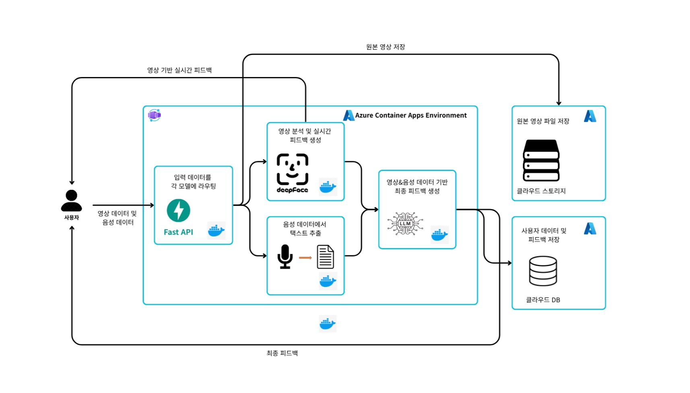
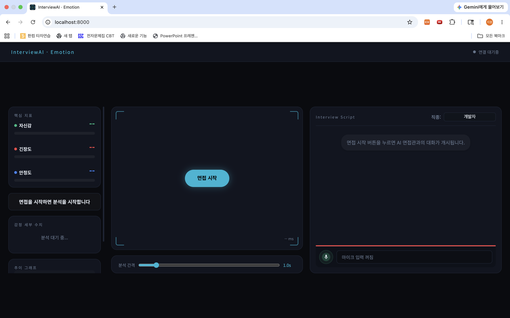
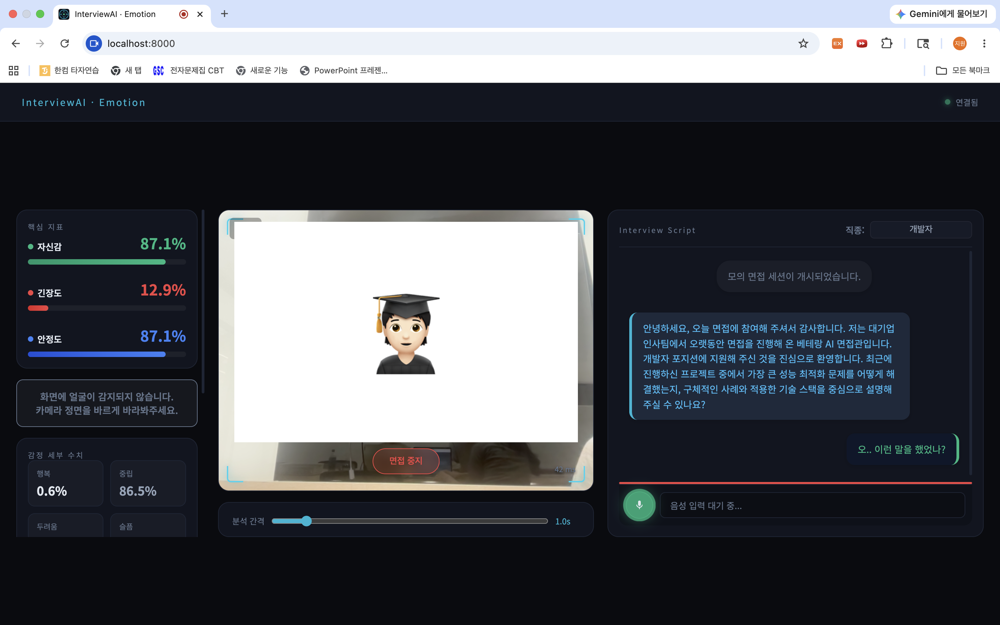
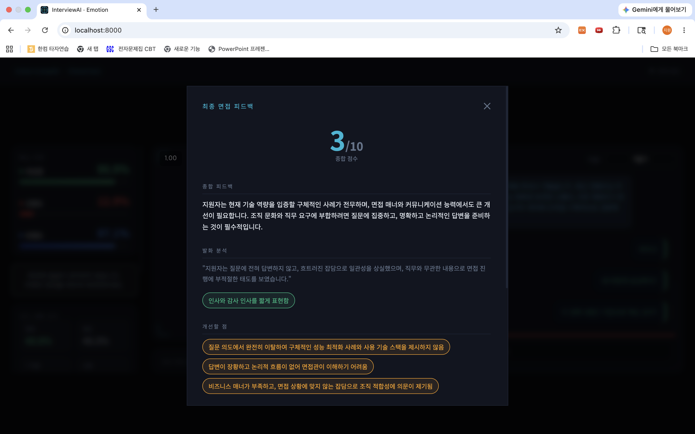

# README

# 프로젝트 명

---

Azure Container Apps(ACA) 기반의 AI 모의 면접 서비스

# 프로젝트 멤버 이름 및 멤버 별 담당한 파트 소개

---

- 강지원
    - DeepFace를 활용하여 자신감, 긴장도, 안정도를 수치화하여 유저에게 제공하는 웹페이지 제작
    - Azure Container Apps를 통한 Auto Scaling(Scale-in, Scale-out) 테스트 진행
- 김영빈
    - Semi-real-time 음성 인식 기능 구현
    - LLM을 활용한 채팅형 면접 기능 구현
- 한지석
    - 마이크로서비스 아키텍처(MSA) 구조 설계 및 API 게이트웨이 연동
    - 멀티모달 데이터(영상 분석 결과 및 STT 텍스트) 기반의 LLM 면접 피드백 실시간 추론 파이프라인 구축
    - Azure Container Apps의 블루-그린(Blue-Green) 배포 테스트 진행

# 프로젝트 소개

---

 본 프로젝트는 실시간 영상 분석(DeepFace), 음성 인식(Whisper), 피드백 생성(LLM) 모듈을 독립된 마이크로서비스 아키텍처(MSA) 구조로 분리하고, 이를 클라우드 네이티브 인프라와 융합하여 서비스 가용성을 극대화한 AI 모의 면접 서비스이다.

 각 기능 모듈을 독립된 마이크로서비스로 쪼개어 Docker 컨테이너로 패키징되어 완전관리형 서버리스 플랫폼인 Azure Container Apps(ACA) 환경에 배포된다. 이를 통해 내장된 인그레스를 통한 효율적인 트래픽 분산과, 실시간 부하 및 이벤트 기반의 유연한 자동 확장(Auto-Scaling), 그리고 무부하 시 리소스를 0 으로 축소(Scale-to-Zero)하는 고가용성 및 비용 최적화된 안정적인 서비스 구조를 갖춘다.

# 프로젝트 필요성 소개

---

 통계청에 따르면 청년 취업 준비생이 58만 명에 달할 정도로 면접 연습 수요가 높지만, 대면 모의 면접이나 전문 컨설팅은 시간과 비용 부담이 크고 객관적인 자가 평가가 어렵다. 본 서비스는 웹 브라우저만으로 언제 어디서나 객관적인 멀티모달 평가 리포트를 제공하여 이 문제에 대한 해결책을 제시한다.

 또한, 고부하 AI 모델 서빙은 초기 투자 비용과 관리 인력이 부족한 스타트업 및 중소기업에 큰 진입 장벽이다. 이를 해결하기 위해 Azure Container Apps(ACA) 기반의 서버리스 인프라를 채택하여, 유휴 상태에는 자원을 완전히 끄는 Scale-to-Zero로 비용 낭비를 막고 트래픽 증가 시에만 동적으로 오토스케일링한다. 결과적으로 초기 인프라 투자 없이도 고가용성 AI 서빙 환경을 안정적으로 운영하여 기술 도입의 비용 효율성을 극대화한다.

# 관련 기술/논문/특허 조사 내용 소개

---

**뷰인터**

뷰인터는 대기업 AI 면접 환경을 그대로 구현한 플랫폼으로, 면접 중 실시간 경고 대신 면접이 끝난 후 수 분 이내에 종합 분석 리포트를 제공한다. 지원자의 음성(발음 명료도, 목소리 톤), 영상(시선 집중도, 표정 변화), 그리고 답변 내용(직무 키워드, 논리 구조)을 멀티모달 방식으로 각각 분리하여 정밀 분석하며, 최종적으로 취약 구간 타임스탬프와 요소별 방사형 그래프를 통해 시선 처리나 긴장도 등 고쳐야 할 약점을 직관적으로 짚어준다.

**Azure Container Apps**

Azure Container Apps(ACA)는 쿠버네티스의 복잡한 인프라 관리 없이 컨테이너를 운영하는 완전관리형 서버리스 플랫폼이다. 내장된 KEDA를 통해 트래픽에 맞춰 정교하게 오토스케일링하며, 유휴 상태 시 **Scale-to-Zero(0으로 축소)** 및 초 단위 과금으로 비용을 최소화한다.

또한, **Dapr 통합**으로 마이크로서비스 간 호출이 안정적이고, **자체 리비전 관리**를 통해 블루-그린(Blue-Green) 무중단 배포와 트래픽 제어를 직관적으로 수행한다. 내장형 인그레스와 Azure Monitor까지 기본 제공하여 복잡한 설정 없이도 고가용성 AI 모듈 서빙 인프라를 효율적으로 구축할 수 있다.

**Blue-Green 배포**
두 개의 동일한 운영 환경을 동시에 실행하여 **무중단 배포**를 달성하고 **빠른 롤백**을 가능하게 하는 소프트웨어 릴리즈 전략을 의미한다. 똑같은 서버 환경 2개(구버전, 신버전)을 만들어 두고, 라우팅 스위치만 꺾어서 한 번에 사용자들을 이동시키는 배포방식이다.

# 프로젝트 개발 결과물 소개 (+ 다이어그램)

---



# 개발 결과물을 사용하는 방법 소개 (설치 방법, 동작 방법 등)

---

### [로컬 배포] Docker Comose

## **사전 준비**

- [Docker Desktop](https://www.docker.com/products/docker-desktop/) 설치 및 실행
- 프로젝트 루트에 `.env` 파일 생성

```
# .env
GROQ_API_KEY=your_actual_groq_api_key
```

---

## **실행 방법**

**1. 빌드 (최초 1회 또는 코드 변경 시)**

```
docker compose build
```

**2. 실행**

```
docker compose up -d
```

**3. 상태 확인**

```
docker compose ps
```

4개 서비스가 모두 `Up` 상태이면 정상

```
router           Up    0.0.0.0:8000->8000/tcp
video-analysis   Up    0.0.0.0:8001->8001/tcp
audio-stt        Up    0.0.0.0:8002->8002/tcp
llm-feedback     Up    0.0.0.0:8003->8003/tcp
```

**4. 접속**

브라우저에서 아래 주소로 접속

```
http://localhost:8000
```

---

## **종료 방법**

```
docker compose down
```

---

## **문제 해결**

**로그 확인**

```
# 전체 로그
docker compose logs

# 특정 서비스 로그
docker compose logs router
docker compose logs video-analysis
docker compose logs audio-stt
docker compose logs llm-feedback
```

**특정 서비스만 재빌드**

```
docker compose build router
docker compose up -d
```

**헬스체크**

```
curl http://localhost:8000/health
curl http://localhost:8001/health
curl http://localhost:8002/health
curl http://localhost:8003/health
```

> `unhealthy` 표시가 있어도 각 헬스체크에서 응답이 오면 정상 동작 중임
> 

---

## [클라우드 배포] Azure Container Apps + Blue Green

#### ACA (Azure Container Apps) 배포 가이드

### 전체 과정

**로컬의 컨테이너**를 **Azure Container Registry**에 업로드 후 **Azure Container App**에 배포하는 과정이다.

```
로컬 => ACR => ACC              
```

---

## 0. 사전 준비

```bash
# Azure CLI 로그인
az login

# 필요 확장 설치
az extension add --name containerapp --upgrade

# 변수 설정
RESOURCE_GROUP=rg-interview
LOCATION=koreacentral
ACR_NAME=interviewacr          # 전역 고유 이름
ACA_ENV=interview-env
```


## 1. 리소스 그룹 & ACR 생성

```bash
az group create --name $RESOURCE_GROUP --location $LOCATION

az acr create \
  --resource-group $RESOURCE_GROUP \
  --name $ACR_NAME \
  --sku Basic \
  --admin-enabled true
```


## 2. 이미지 빌드 & ACR 푸시

```bash
# ACR 로그인
az acr login --name $ACR_NAME

ACR_SERVER=$(az acr show --name $ACR_NAME --query loginServer -o tsv)

## 수정 - 현재 develop 브랜치(최신 브랜치)기준 "각 서비스 빌드 & 푸시"는 다음과 같은 명령어로 동작됨
for svc in router video-analysis audio-stt llm-feedback; do
  docker build -t $ACR_SERVER/interview-$svc:v1 ./services/$svc
  docker push $ACR_SERVER/interview-$svc:v1
done
```

> 이미 ACR에 이미지들을 빌드 했다면 생략
> 


## 3. Container Apps Environment 생성

```bash
az containerapp env create \
  --name $ACA_ENV \
  --resource-group $RESOURCE_GROUP \
  --location $LOCATION
```


## 4. ACR 자격증명 확인

```bash
ACR_USERNAME=$(az acr credential show --name $ACR_NAME --query username -o tsv)
ACR_PASSWORD=$(az acr credential show --name $ACR_NAME --query "passwords[0].value" -o tsv)
```


## 5. 내부 서비스 배포 (Internal Ingress)

### 5-1. video 서비스

```bash
az containerapp create \
  --name interview-video-analysis \
  --resource-group $RESOURCE_GROUP \
  --environment $ACA_ENV \
  --image $ACR_SERVER/interview-video-analysis:v1 \
  --registry-server $ACR_SERVER \
  --registry-username $ACR_USERNAME \
  --registry-password $ACR_PASSWORD \
  --target-port 8001 \
  --ingress internal \
  --cpu 1.0 --memory 2.0Gi \
  --min-replicas 1 --max-replicas 3
```

### 5-2. audio 서비스

```bash
az containerapp create \
  --name interview-audio-stt \
  --resource-group $RESOURCE_GROUP \
  --environment $ACA_ENV \
  --image $ACR_SERVER/interview-audio-stt:v1 \
  --registry-server $ACR_SERVER \
  --registry-username $ACR_USERNAME \
  --registry-password $ACR_PASSWORD \
  --target-port 8002 \
  --ingress internal \
  --cpu 2.0 --memory 4.0Gi \
  --min-replicas 1 --max-replicas 3
```

### 5-3. llm 서비스

```bash
az containerapp create \
  --name interview-llm-feedback \
  --resource-group $RESOURCE_GROUP \
  --environment $ACA_ENV \
  --image $ACR_SERVER/interview-llm-feedback:v1 \
  --registry-server $ACR_SERVER \
  --registry-username $ACR_USERNAME \
  --registry-password $ACR_PASSWORD \
  --target-port 8003 \
  --ingress internal \
  --cpu 0.5 --memory 1.0Gi \
  --min-replicas 1 --max-replicas 5 \
  --env-vars GROQ_API_KEY=secretref:groq-api-key
```


## 6. Secret 등록 (GROQ_API_KEY)

```bash
az containerapp secret set \
  --name interview-llm-feedback \
  --resource-group $RESOURCE_GROUP \
  --secrets groq-api-key=<자신의 Groq API-KEY>
```


## 7. 내부 FQDN 확인

ACA 내부 서비스는 `<앱이름>.<환경내부도메인>` 형식의 FQDN으로 통신함

```bash
VIDEO_FQDN=$(az containerapp show \
  --name interview-video-analysis \
  --resource-group $RESOURCE_GROUP \
  --query "properties.configuration.ingress.fqdn" -o tsv)

AUDIO_FQDN=$(az containerapp show \
  --name interview-audio-stt \
  --resource-group $RESOURCE_GROUP \
  --query "properties.configuration.ingress.fqdn" -o tsv)

LLM_FQDN=$(az containerapp show \
  --name interview-llm-feedback \
  --resource-group $RESOURCE_GROUP \
  --query "properties.configuration.ingress.fqdn" -o tsv)

echo "VIDEO : $VIDEO_FQDN"
echo "AUDIO : $AUDIO_FQDN"
echo "LLM   : $LLM_FQDN"
```


## 8. router 서비스 배포 (External Ingress)

```bash
az containerapp create \
  --name interview-router \
  --resource-group $RESOURCE_GROUP \
  --environment $ACA_ENV \
  --image $ACR_SERVER/interview-router:v1 \
  --registry-server $ACR_SERVER \
  --registry-username $ACR_USERNAME \
  --registry-password $ACR_PASSWORD \
  --target-port 8000 \
  --ingress external \
  --cpu 0.5 --memory 1.0Gi \
  --min-replicas 1 --max-replicas 5 \
  --env-vars \
    VIDEO_MODEL_URL=wss://$VIDEO_FQDN/ws/analyze \
    AUDIO_MODEL_URL=wss://$AUDIO_FQDN/ws/stream \
    LLM_SERVICE_URL=https://$LLM_FQDN/feedback
```

> ⚠️ ACA 내부 HTTPS/WSS는 자동으로 TLS 종료됩니다.
> 
> 
> 내부 통신이라도 `wss://`, `https://` 를 사용하세요.
> 


## 9. router 외부 URL 확인

```bash
ROUTER_URL=$(az containerapp show \
  --name interview-router \
  --resource-group $RESOURCE_GROUP \
  --query "properties.configuration.ingress.fqdn" -o tsv)

echo "Router URL: https://$ROUTER_URL"
```


## 10. 리소스 정리

```bash
az group delete --name $RESOURCE_GROUP --yes
```

---


### 웹 사용 설명


[초기 화면]



- 면접 시작버튼을 눌러 면접을 시작할 수 있습니다.


[면접 중 화면]



- 면접 중에는 카메라와 마이크가 활성화되며, 유저는 오른쪽 화면에 AI 면접관이 생성한 질문에 대한 답변을 시작하면 됩니다.
- 답변은 음성인식을 통해 오른쪽 화면에 기록되며, 면접 중 유저의 표정 변화에 따른 감정 변화를 수치화하여 왼쪽 화면과 같이 제공됩니다.


[면접 결과 및 피드백 화면]



- 면집 진행 후 면접 중지 버튼을 누르면 영상 및 음성을 분석하여 LLM 피드백이 제공됩니다.


# 개발 결과물의 활용방안 소개

---

- **사용자 관점: 개인 맞춤형 상시 면접 훈련 플랫폼**
취업 준비생들은 시공간의 제약 없이 웹 브라우저만을 활용해 대면 컨설팅 수준의 면접 연습을 반복할 수 있다. 정량화된 멀티모달 분석 리포트와 타임스탬프 기반의 피드백을 통해 본인의 시선 처리, 감정 변화, 답변 논리 구조의 취약점을 스스로 파악하고 개선하는 자가 학습 도구로 활용 가능하다.

- **개발자 및 기업 관점: 플러그앤플레이(Plug-and-Play)형 AI 면접 솔루션**
본 프로젝트는 각 분석 기능을 마이크로서비스(MSA) 모듈로 분리하고 Docker 컨테이너로 가상화하여 설계했다. 따라서 향후 특정 기업이나 직군별로 특화된 자체 AI 모델(예: 커스텀 fine-tuning된 LLM이나 고도화된 안면 인식 모델)이 개발되더라도, 전체 시스템을 재구축할 필요 없이 해당 컨테이너 모듈만 독립적으로 교체(Plug-and-Play)하여 쉽게 시스템을 고도화할 수 있다.

# AI 활용 (어떤 AI를 사용하여 개발했으며, 전체 코드의 몇 %가 AI로 개발되었는지를 설명)

---

- 전체 코드의 40%가 AI로 개발
    - 웹 컴포넌트 레이아웃 및 UI 디자인 코드 생성에 활용 (Claude)
    - 정보 공유를 위한 리서치 자료 문서화 (Gemini)
    - 테스트 코드 생성 및 에러 디버깅 (Gemini)